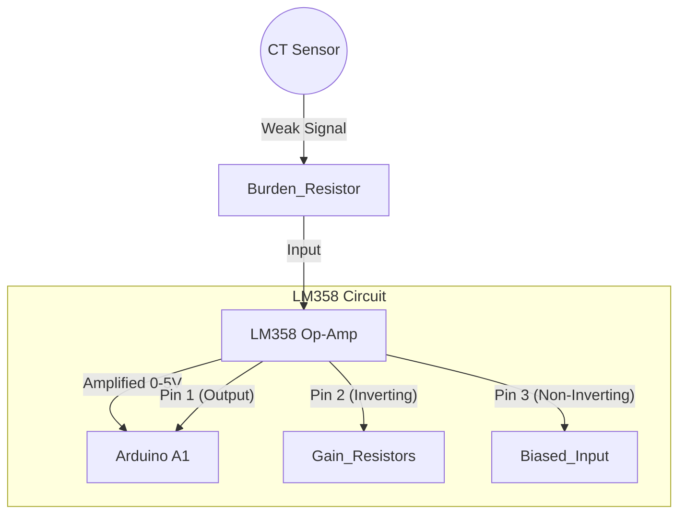

# Current Sensor Schematic (LM358 Amplifier)

Using an **LM358 Operational Amplifier** gives much better accuracy for small currents than the passive resistor method, because it can amplify the tiny signal from the CT coil.

## Circuit Diagram



## Detailed Wiring 

**Components:**
1.  **LM358** (8-pin Op-Amp IC).
2.  **CT Sensor**.
3.  **Burden Resistor** (100Ω).
4.  **Resistors for Gain**: 10kΩ and 100kΩ (Gain = 10x).

**Pinout for LM358:**
- **Pin 8**: VCC (5V from Arduino)
- **Pin 4**: GND (Ground)
- **Pin 3 (+)**: Input from CT (Positive side)
- **Pin 2 (-)**: Connected to Ground via 10k resistor, and to Output (Pin 1) via 100k resistor (Feedback).
- **Pin 1 (Out)**: Connect to **Arduino A1**.

```text
       100k Resistor (Feedback)
       +-----------------------+
       |                       |
       |     LM358             |
       +----o Pin 2 (-)        |
       |                       |
      10k      Pin 1 (Out) >---+----> Arduino A1
       |
      GND

      CT Coil (+ wire) >----o Pin 3 (+)
      CT Coil (- wire) >----o GND
```

**Why use LM358?**
- **Amplification**: Can detect very small currents (e.g. turning on a single light bulb).
- **Rectification**: Can be configured to output only positive voltage, protecting the Arduino.
- **Buffer**: Protects the Arduino from high spikes.
